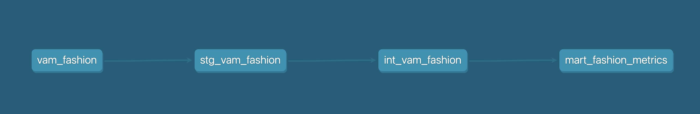

# V&A Fashion Analytics Project (dbt)

## Project Overview
This project transforms raw historical fashion data from the Victoria and Albert (V&A) Museum into a structured analytical warehouse using **dbt** and **DuckDB**. 

The goal is to move from messy, unstructured metadata to a clean **Star Schema** that allows for analyzing fashion trends across centuries, categories, and materials.

## Data Architecture & Lineage
I implemented a multi-layer dbt architecture to ensure data quality and scalability:

1.  **Seeds**: Initial raw data (CSV) containing museum object records.
2.  **Staging (`stg_`)**: Data cleaning layer. Here I:
    * Renamed columns to `snake_case`.
    * Cast data types (dates, IDs).
    * Filtered out records with missing essential metadata.
3.  **Intermediate (`int_`)**: Business logic layer.
    * Unified categories.
    * Extracted century information from complex date strings.
4.  **Marts (`mart_`)**: Final analytical layer.
    * Created `mart_fashion_metrics` to serve as a single source of truth for BI tools.

### Lineage Graph
 

## Key Metrics Developed
* **Object Count by Century**: Identifying the most represented eras in the collection.
* **Material Diversity**: Analyzing the most common materials used in fashion over time.
* **Data Completeness**: Monitoring the quality of museum metadata.

## Tech Stack
* **dbt Core**: For data transformation and modeling.
* **DuckDB**: As the high-performance analytical engine.
* **SQL**: For complex logic and aggregations.
* **Git**: For version control and CI/CD best practices.

## How to Run
1. Clone the repository.
2. Install dbt: `pip install dbt-duckdb`.
3. Run seeds: `dbt seed`.
4. Build the pipeline: `dbt build`.
